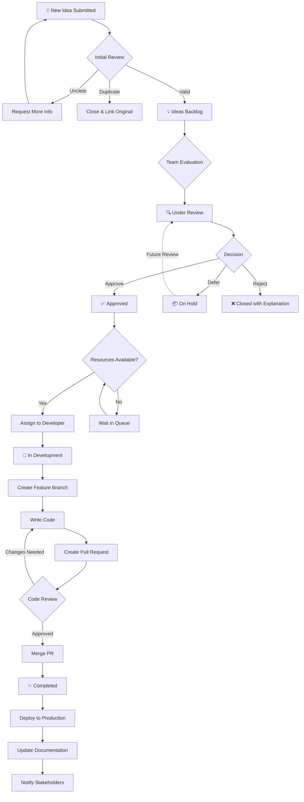

# Idea Workflow - Visual Guide

This document provides a visual representation of how ideas flow through the GitHub Projects system for Gemini Video.

## 🔄 Complete Idea Lifecycle



## 📊 State Transitions

### 1️⃣ Submission Phase

```
User Submits Idea
       ↓
[Using Issue Template]
       ↓
Idea Created with Label "idea"
       ↓
Auto-Added to Project
       ↓
Lands in "💡 Ideas Backlog"
```

**Time**: Instant  
**Who**: Any contributor  
**Next Step**: Wait for initial review

---

### 2️⃣ Initial Review Phase

```
💡 Ideas Backlog
       ↓
Team Member Reviews
       ↓
   ┌───┴───┐
   ↓       ↓
Valid  Needs Info
   ↓       ↓
Move   Request
   ↓   Clarification
🔍 Under     ↓
 Review   Back to
          Backlog
```

**Time**: 1-3 days  
**Who**: Maintainers/Reviewers  
**Criteria**: 
- Is it clear?
- Is it duplicate?
- Does it fit project goals?

---

### 3️⃣ Evaluation Phase

```
🔍 Under Review
       ↓
Detailed Analysis:
• Technical Feasibility
• Resource Requirements
• Priority Assessment
• ROI Evaluation
       ↓
    Decision
    ┌──┴──┐
    ↓     ↓     ↓
Approve Defer Reject
    ↓     ↓     ↓
    ✅    📦    ❌
Approved Hold Close
```

**Time**: 3-7 days  
**Who**: Project leads, technical team  
**Outcome**: Approved, On Hold, or Closed

---

### 4️⃣ Development Phase

```
✅ Approved
       ↓
Wait for Resources
       ↓
Developer Assigned
       ↓
🚧 In Development
       ↓
Implementation Steps:
1. Create feature branch
2. Write code
3. Write tests
4. Update docs
5. Create PR
       ↓
Code Review
       ↓
Merge to Main
       ↓
✨ Completed
```

**Time**: 1-4 weeks (varies by effort)  
**Who**: Developers, reviewers  
**Output**: Working feature in production

---

## 🎯 Decision Criteria

### When to Approve ✅

- ✅ Aligns with project goals
- ✅ Technical feasibility confirmed
- ✅ Resources available or scheduled
- ✅ Clear benefit to users
- ✅ Reasonable scope
- ✅ No major technical debt concerns

### When to Defer 📦

- 📦 Good idea but wrong timing
- 📦 Requires other features first
- 📦 Resource constraints
- 📦 Needs more research
- 📦 Lower priority than current work

### When to Close ❌

- ❌ Duplicate of existing idea
- ❌ Out of scope for project
- ❌ Technical limitations make it infeasible
- ❌ Conflicts with project direction
- ❌ Better alternative exists

## 👥 Role Responsibilities

### 💡 Idea Creator
1. Submit idea using template
2. Respond to clarification requests
3. Participate in discussion
4. Test implementation when ready

### 🔍 Reviewer/Maintainer
1. Initial review within 3 days
2. Request clarification if needed
3. Move to "Under Review"
4. Facilitate team discussion
5. Make or guide decision

### 🎯 Project Lead
1. Evaluate business value
2. Assess priority
3. Make approval decisions
4. Assign to milestones
5. Track completion

### 👨‍💻 Developer
1. Understand requirements
2. Ask questions
3. Implement solution
4. Write tests
5. Update documentation
6. Create PR
7. Address review feedback

## ⏱️ Time Expectations

| Phase | Expected Time | Maximum Time |
|-------|---------------|--------------|
| Initial Review | 1-3 days | 1 week |
| Under Review | 3-7 days | 2 weeks |
| Approved (waiting) | Varies | N/A |
| In Development | 1-4 weeks | 6 weeks |
| Code Review | 1-3 days | 1 week |
| Total (simple idea) | 2-4 weeks | 8 weeks |
| Total (complex idea) | 4-8 weeks | 12 weeks |

## 🚨 Escalation Process

### Idea Stuck Too Long?

```
1. Check Status
   ↓
2. Add Comment Requesting Update
   ↓
3. Wait 3 Days
   ↓
4. Tag Maintainer
   ↓
5. Wait 1 Week
   ↓
6. Open Discussion Thread
```

### Priority Change Needed?

```
1. Comment on Issue
   ↓
2. Explain Why Priority Should Change
   ↓
3. Provide Supporting Data
   ↓
4. Tag Project Lead
   ↓
5. Wait for Re-evaluation
```

## 📈 Success Metrics

Track these to measure workflow health:

### Throughput Metrics
- **Ideas per week**: New idea submission rate
- **Approval rate**: % of ideas that get approved
- **Completion rate**: % of approved ideas completed
- **Velocity**: Ideas completed per sprint/month

### Time Metrics
- **Time to first review**: Initial response time
- **Time to decision**: From submission to approval/defer/close
- **Time to completion**: From approval to done
- **Lead time**: Full cycle from idea to production

### Quality Metrics
- **Rework rate**: % of ideas requiring significant changes
- **Closure reason**: Why ideas were closed (duplicate, out of scope, etc.)
- **Community engagement**: Comments, reactions, participation

### Health Indicators

🟢 **Healthy**: 
- Ideas reviewed within 3 days
- Clear decisions within 2 weeks
- Steady completion rate
- Active discussion

🟡 **Needs Attention**:
- Reviews taking > 1 week
- Growing backlog
- Stalled "In Development" items
- Low completion rate

🔴 **Critical**:
- Ideas ignored > 2 weeks
- Zero completions
- High closure rate
- No team participation

## 🔄 Feedback Loop

```
✨ Idea Completed
       ↓
Deployed to Production
       ↓
Monitor Usage/Impact
       ↓
Gather User Feedback
       ↓
   ┌──┴──┐
   ↓     ↓
Success Need Iteration
   ↓     ↓
Share   Create
Results Follow-up
   ↓    Idea
Document    ↓
Best      New Issue
Practice    ↓
       💡 Back to Start
```

## 🎓 Learning from Ideas

### After Completion
- Document what worked well
- Note challenges encountered
- Update estimates for similar ideas
- Share learnings with team

### After Deferral
- Document why deferred
- Set review date
- Keep stakeholders informed
- Revisit when conditions change

### After Closure
- Explain decision clearly
- Link to alternatives if available
- Thank contributor
- Encourage future submissions

## 💡 Best Practices

### For Faster Processing
1. Use the template completely
2. Be specific and clear
3. Include mockups/examples
4. Link related issues
5. Respond promptly to questions

### For Better Outcomes
1. Research existing solutions first
2. Focus on user value
3. Consider implementation complexity
4. Think about edge cases
5. Be open to alternatives

### For Smooth Development
1. Break down large ideas
2. Define clear acceptance criteria
3. Identify technical dependencies
4. Consider backward compatibility
5. Plan for testing

## 🆘 Common Issues

| Issue | Cause | Solution |
|-------|-------|----------|
| Idea ignored | Lost in backlog | Tag maintainer |
| Unclear requirements | Incomplete template | Add more details |
| Duplicate idea | Didn't search first | Search before submit |
| Scope creep | Too ambitious | Break into smaller ideas |
| Blocked dependency | Requires other feature | Move to "On Hold" |
| Resource shortage | Team busy | Add to milestone queue |

---

## 📚 Additional Resources

- [Full GitHub Projects Guide](../GITHUB_PROJECTS_GUIDE.md)
- [Quick Reference](PROJECTS_QUICK_REFERENCE.md)
- [Project Setup Example](PROJECT_SETUP_EXAMPLE.md)
- [Issue Template](ISSUE_TEMPLATE/idea.yml)

---

**Ready to submit your first idea?** [Create New Idea →](https://github.com/milosriki/geminivideo/issues/new?template=idea.yml)
